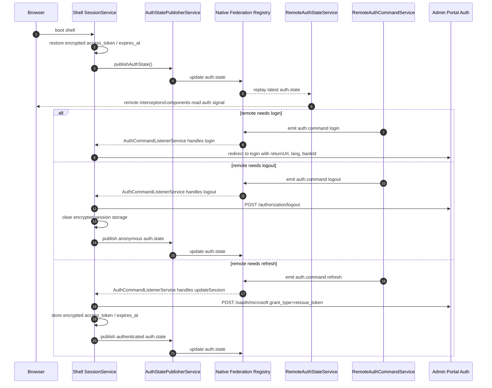

# Equity Auth Flow

Equity Auth is the cross-MFE protocol for authentication state and commands. The Shell remains the owner of the browser session, token lifecycle, redirects, and logout HTTP calls. Remote MFEs consume the published state and emit commands through the Native Federation event registry.

## Ownership boundaries

- Shell owns the session lifecycle, encrypted token storage, login redirect, logout call, token refresh, and the canonical `AuthState` projection.
- `equity-auth` owns shared protocol contracts and remote-side adapters:
  - `auth.state` for replayable state updates.
  - `auth.command` for remote-to-shell commands.
  - `RemoteAuthStateService` for remote signal state.
  - `RemoteAuthCommandService` for login/logout/refresh commands.
- Remotes must not read Shell session internals directly; they depend on `equity-auth` only.
