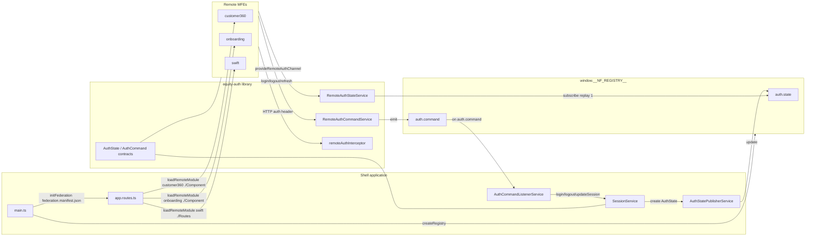

# Native Federation Architecture

The workspace uses Angular Native Federation for loading independently built MFEs and the Native Federation Orchestrator event registry for cross-MFE auth communication.

## Loading model

- `projects/shell/src/main.ts` creates `window.__NF_REGISTRY__` before calling `initFederation('federation.manifest.json')`.
- `projects/shell/src/app/app.routes.ts` lazy-loads remotes with `loadRemoteModule`.
- The Shell route guard protects the Shell-owned route tree before remotes are loaded.

## Auth communication model

- `auth.state` is stateful and replayed so remotes can receive the latest Shell auth projection after boot.
- `auth.command` is command-oriented and does not persist command history beyond the registry replay settings.
- The protocol library is intentionally named `equity-auth` because it represents the shared Equity authentication contract, not a Shell-private implementation detail.
